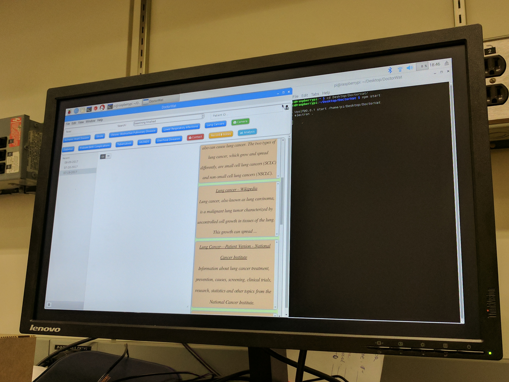

## IBM 2017 Blue|Hack Project
 Hackathon Challenge: [TJBot](https://ibmtjbot.github.io), Smart IOT

HackDash link: [DoctorWat](https://hackdash.org/projects/597152357a30a4526a1fea12)
### Topic:
Public health data is important for both industry and research projects, but it is hard for doctors to collect information from their patients when they are not in a hospital. Recording data at home involves searching information online, taking notes and getting medical help from doctors. Most applications require a laptop and only provides a few functions for patients.

### Goal:
 To create a desktop application that can collect user data to reduce the information gap between doctors and patients. The application should be simple for both doctors and patients to use.

#### click the following image to watch our demo on youtube
[](https://www.youtube.com/watch?v=8t4sXKKVstY&t=25s)
### Installation Instructions for Developers
To use Watson API with TJBot, please first follow the [instructions](http://www.instructables.com/id/Use-Your-Voice-to-Control-a-Light-With-Watson/) to set up your raspberry pi and sign up your Bluemix service.

First of all, clone from master:
```bash
git clone https://github.com/wilsonandusa/DoctorWat.git
```
Since the TJBot library uses some of the C/C++ dependencies, we could not run it within electron, my solution is to seperate them into different folders, and install the tjBot dpendencies before the electron dependencies.  
To install dependencies:
```bash
# first install dependencies for the TJbot
cd DoctorWat/speech_to_text
npm install
# then install dependencies for the electron
cd ..
npm install
bower install
```
Don't forget to add your Bluemix services username&password(be careful about the order) in config files, here's a link to the [instructions](https://github.com/wilsonandusa/DoctorWat/tree/master/speech_to_text)


To start the application, type:
```bash
npm start
```
